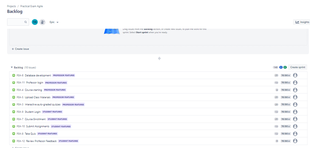
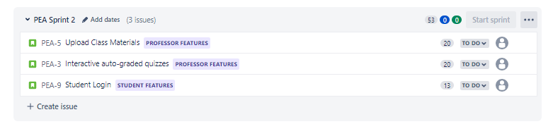

# Practical-Exam-Agile-SW
- Name: Youssef Alsabban
- ID: 18P9253

## Faculty Management System

### Backend Team

#### Alaa
- **Role:** Database Designer
- **Expertise:** MySQL, SQLite

#### Diaa
- **Role:** Backend Developer
- **Expertise:** Python, PHP, Java

#### Wael
- **Role:** Backend Developer
- **Expertise:** Ruby, Java, C#

### Front End Team

#### Samir
- **Role:** UI/UX Designer
- **Expertise:** HTML5, CSS, JavaScript

#### Maged
- **Role:** UI/UX Designer
- **Expertise:** Java, HTML5, CSS, JavaScript

#### Gamal
- **Role:** Mobile Front End Designer
- **Expertise:** Java, HTML5, CSS, JavaScript

#### Youssef
- **Role:** Graphics Developer
- **Expertise:** Java, HTML5, CSS, JavaScript, WebGL, Three.js

### Testing Team

#### Hossam
- **Role:** Unit Tester
- **Expertise:** Selenium , JavaScript

#### Ibrahim
- **Role:** Penetration Tester
- **Expertise:** SQL Injection, Brute Force

#### Hesham
- **Role:** Integration Testing
- **Expertise:** Test design, Test Development, Database Unit

## Stakeholders
- Faculty Staff
- Students
- University Board
- Educational Centres

## Near Vision
### First Sprint
In this sprint, the basic UI/UX design of the system should be completed in order to have a prototype of the system and introduce the use scenarios of the system. The database will also be designed to show the data manipulation by the system.
#### **Overview:**
- Basic UI/UX for the overall system
- Database design and visualization of manipulation of data

### Second Sprint
For this sprint, the functionalities of the system including file transfer will be introduced. Including course material uploads, handing in assignments and quiz answers.
#### **Overview:**
- File transfer functionalities to add class materials, assignments and quizzes
- File modification and deletion functionalities after uploads

## Far Vision
The aim is to develop a fully-functional faculty system that enables full remote learning and eliminate need for paper for assignments, quizzes and course projects. The program should be accessible by all students and faculty staff everywhere regardless of the device used. A reliable automatic grading system should be available where the grades and data can be read by both students and faculty staff but manipulated only by the staff. The system shall accept future changes including new features.

## Convention
For estimating story points, the ***modified Fibonacci Series*** is used {1,2,3,5,8,13,20,40,100}

## Rationale
This project is developed using Test-Driven Developement method. It is the best practice for agile methodologies.

## Notes
- The team finishes an average of **53 Story Points**.
- A sprint takes **2 weeks**.

## Backlog

## Daily meetings examples
### Meeting 1
| Members |             Questions            | Monday                                                     | Tuesday                                                       |
|---------|:--------------------------------:|------------------------------------------------------------|---------------------------------------------------------------|
|  Samir  |      What will you do today?     | I will design the dashboard for professors                 | I will continue the dashboard design                          |
|         |    What did you do yesterday?    | I finished the login screen for professors                 | I was working on the Courses screen on the dashboard          |
|         | Did you encounter any obstacles? | No, I did not                                              | I had a problem with overlapping labels on the courses screen |
|         |                                  |                                                            |                                                               |
| Diaa    |      What will you do today?     | I will work on the course starting feature                 | I will work on the save features                              |
|         |    What did you do yesterday?    | I was working on integrating the database with the backend | I finished the course start feature                           |
|         | Did you encounter any obstacles? | No, I did not                                              | No, I did not                                                 |

### Meeting 2
| Members |             Questions            | Monday                                                    | Tuesday                                                            |
|---------|:--------------------------------:|-----------------------------------------------------------|--------------------------------------------------------------------|
|  Samir  |      What will you do today?     | I will work on the quiz creation screen                   | I will continue working on the quiz creation screen                |
|         |    What did you do yesterday?    | I finished the enrolled students screen                   | I was working on the quiz creation screen                          |
|         | Did you encounter any obstacles? | No, I did not                                             | I had a problem marking correct answers for the quiz on the screen |
|         |                                  |                                                           |                                                                    |
| Diaa    |      What will you do today?     | I will work on the unique Student ID generation algorithm | I will work on the Course Enrollment feature                       |
|         |    What did you do yesterday?    | I was finishing the auto-grading feature for quizzes      | I finished the Student ID generation Algorithm                     |
|         | Did you encounter any obstacles? | No, I did not                                             | No, I did not                                                      |

## Sprint Document
### Sprint goal
For this sprint, the materials and quiz upload features for the professor should be finished. Also, the student login feature should be done too.
### Sprint backlog

### Epics to be delivered
Professor Features
### Progress of previous sprint
Created the database and integrated it with the system, completed the professor login feature and screen and finished the course creation feature 
